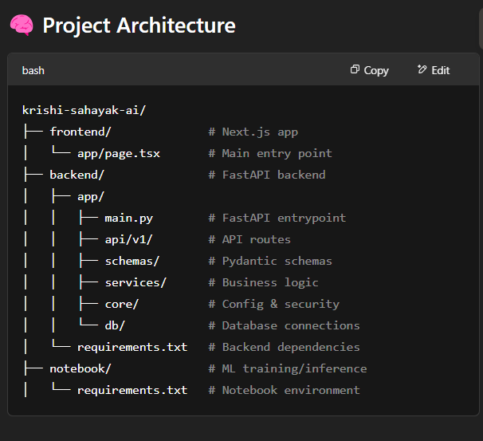

👋 Hello Everyone!

We are Team PsyDucks.

Team Details:
Team Name - PsyDucks
Team Leader - Ashish Kr. Choudhary
TeamMember 1. Joyal Jijo
           2. Aditya
           3. Adarsh singh   

Problem We're Solving
Indian smallholder farmers face significant challenges in managing their crops efficiently and profitably. They often lack timely, localized information, struggle with pest and disease identification, and miss opportunities for better market access or financial support. These gaps result in suboptimal yields, high costs, and financial stress.

Solution --- >  KRISHI SAHAYAK AI

🌾 Krishi Sahayak AI
Krishi Sahayak AI is an end-to-end solution designed to support Indian smallholder farmers with AI-driven hyperlocal weather forecasts and actionable agricultural advisories. The system consists of a modern Next.js frontend, a robust FastAPI backend, and powerful ML models for weather prediction and agronomic recommendations.

Features -- 
1. 🌤️ Hyperlocal AI Weather Forecasts & Farm Advisories (Gyan Dhara)
Problem Solved: Inaccurate or untimely weather data leading to poor farm decisions and also give next 15 days weather prediction.

Highlights:
AI models (LSTM/Transformers) generate hyperlocal forecasts for temperature, rain, humidity, and wind.
Translates forecasts into crop-specific, stage-aware recommendations in regional languages (text + voice).
Delivers alerts via app, SMS, and chatbot (“कल बारिश होगी या नहीं?”).
Forecast-aware recommendations proactively guide actions (e.g., irrigation, spraying).

2. 🐛 AI Pest & Disease Detection (Fasal Doctor)
Problem Solved: Crop loss from late or inaccurate diagnosis and misuse of chemicals.

Highlights:
Farmers upload crop photos; AI (CNN) diagnoses issues with confidence scores.
Multilingual info on symptoms, lifecycle, and damage.
Recommends IPM measures (cultural → biological → chemical), including safe pesticide details and links to trusted sellers.
Escalates low-confidence cases to experts (KVKs/Universities).
Advises on local outbreaks and preventive scouting.

3. 💳 AI-Driven Alternative Credit Scoring (Arthik Sahara)
Problem Solved: Financial exclusion due to lack of collateral or credit history.

Solution Details:

Partnerships with Financial Institutions (FIs): Collaborates with banks, MFIs, and NBFCs to offer loans to farmers based on app data, including farm activity, transactions, and crop performance.

AI Credit Scoring: Uses AI models to analyze behavioral and agricultural data to generate a personalized credit score that reflects the farmer's financial behavior and farm performance.

Farmer-Friendly Application Process: Farmers can easily access and view available credit offers through a simplified interface, with the ability to apply for loans in just a few steps.

Schema Display for Clarity: Provides a detailed schema of available schemes, eligibility criteria, and the step-by-step application process for each loan, making it easy for farmers to understand their options.

Transparent Scoring System: AI provides clear explanations of the factors contributing to the credit score and offers practical improvement tips to help farmers boost their creditworthiness over time.

Data Privacy and Consent: Only shares the farmer's data with financial institutions upon receiving explicit consent during the loan application process, ensuring privacy and security.

Updates and Notifications: Farmers receive real-time updates on changes in their credit score, new loan offers, and eligibility for various financial schemes. The app proactively notifies farmers about loan opportunities and important deadlines.

Eligibility Check: Farmers can check their eligibility for different schemes and apply directly through the app, streamlining the process and reducing reliance on intermediaries.

4. 🤝 FPO Management & Collective Action Tools (Samuday Shakti)
Problem Solved: Fragmented farming, weak negotiation, and coordination gaps.

Highlights:
Dedicated digital dashboard for FPOs.
Manage members, contributions, and announcements.
Group chat, joint calendar for collective activities.
Coordinate bulk input procurement and market aggregation.
Enable internal equipment rentals/sharing.

5. 🤖 AI-Powered Multilingual Chatbot (Krishi Mitra Bot)
Problem Solved: Navigation and support challenges for tech-limited users.

Highlights:
Conversational, context-aware AI bot in regional languages.
Answers questions like “मेरे खेत में कीट क्यों आ रहे हैं?” or “आज मौसम कैसा रहेगा?”
Guides tasks like uploading reports, listing produce.
Personalized based on location, crops, and activity.
Escalates to human experts if needed.

6. 🔁 Integrated AI Recommendation Engine
Problem Solved: Information overload and missed opportunities.

Highlights:
Continuously learns from user profile, crop stages, weather, prices, disease risks, soil data, and input usage.
Sends timely, personalized advice: e.g., “Ideal time to irrigate wheat,” “Apply neem oil for early pest signs.”
Recommends inputs, insurance, credit, and marketing opportunities proactively.
Delivered via in-app alerts, "For You" dashboard, and chatbot conversations.

🛠️ Tech Stack
Frontend: Next.js 

Backend: FastAPI, Pydantic, Uvicorn

ML Models: LSTM, Transformers, YOLOv12, XGBoost, CatBoost, Prophet

Deployment: Vercel (Frontend), Custom Server (Backend)

Notebook Requirements: Rich ML and CV ecosystem (TensorFlow, PyTorch, OpenCV, etc.)

🧠 Project Architecture

🖥️ Frontend: Getting Started (Next.js)

1.Clone Repo
[<repo-url>](https://github.com/joyal-jij0/pragati.git)

2.Install Dependencies
npm install

3.Run Development Server
npm run dev
Visit http://localhost:3000 in your browser.

🔧 Backend: Getting Started (FastAPI)

1.Clone & Setup
git clone [<repo-url>](https://github.com/joyal-jij0/pragati.git)
cd backend

2.Create a Virtual Environment
  macOS/Linux:
  --python3 -m venv .venv
  --source .venv/bin/activate
  
  Windows:
  --python -m venv .venv
  --.venv\Scripts\activate

3.Install Dependencies
pip install -r requirements.txt

4.Download ML Models
uvicorn app.main:app --reload

5.Run Server
uvicorn app.main:app --reload

6.Visit: http://127.0.0.1:8000
Healthcheck: http://127.0.0.1:8000/api/v1/healthcheck

📚 Notebook Environment

Install Jupyter & ML Packages
 -pip install -r notebook/requirements.txt
